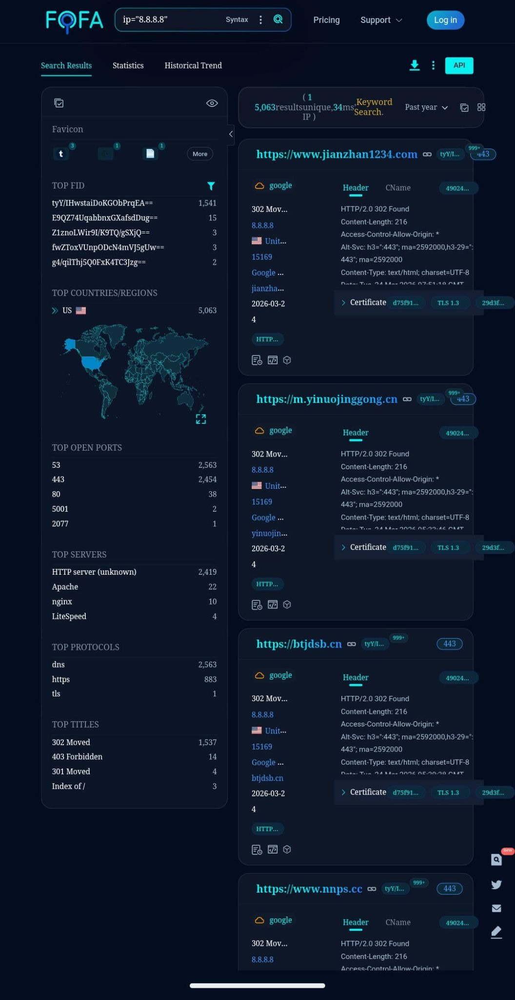

# FOFA

| **FOFA**         | **Quick Overview**                                                                                                                                                    |
| ---------------- | --------------------------------------------------------------------------------------------------------------------------------------------------------------------- |
| URL              | [https://en.fofa.info/](https://en.fofa.info/)                                                                                                                        |
| What it does     | Indexes internet-connected devices, web servers, and services using banners, protocols, and metadata, helping you find exposed devices or investigate infrastructure. |
| How to use it    | Enter search queries using IPs, ports, protocols, or keywords, and explore connected systems.                                                                         |
| Cost             | Partially Free. Limited searches are free, more features require paid plans.                                                                                          |
| Account required | No for basic use. Yes for full searches and exports.                                                                                                                  |
| Cookies          | Site functionality, analytics, and user tracking.                                                                                                                     |
| Ownership        | Owned by Beijing Huashun Xin'an Technology Co., Ltd, a Chinese high-tech cybersecurity firm founded by Zhao Wu.                                                       |
| Use in Reporting | Great for identifying exposed infrastructure, tracking vulnerable services, mapping networks, and supporting cybersecurity investigations.                            |

### What does FOFA do?

FOFA lets you see what devices and services are publicly reachable on the internet. It lets you explore servers, IoT (Internet of Things) devices, cameras, industrial systems, and more, making it useful for mapping global infrastructure.

**The lowdown:** Think of it as a Shodan‑like search engine that finds internet‑exposed devices and services worldwide, powerful for mapping infrastructure, but deeper data requires a paid account and careful interpretation.

### How to Use:

1. **Go to**[ **https://en.fofa.info/**](https://en.fofa.info/) **and enter your search query (IP, protocol, keyword, or domain).&#x20;**_**Note: Try the mobile version if you have trouble via your browser.**_&#x20;

<figure><figcaption></figcaption></figure>

2. **Filter results (by port, country, service type).**
3. **Explore and pivot to related hosts or services.**

### Cost

* [ ] Free
* [x] Partially Free
* [ ] Paid

Limited searches are free. More features require paid plans.

## Data Processing

### Account Required:

* [x] Yes
* [x] No

No for basic use. Yes for full searches and exports.

### Cookies:&#x20;

Cookies here are mostly used for site functionality, analytics, and user tracking. Some track visitor behavior and session activity, while others are third-party cookies for analytics via Baidu.

### Use in Reporting

FOFA can be used to:

* Discover exposed servers, IoT devices, and services.
* Identify vulnerable or misconfigured infrastructure.
* Map networks and internet-connected systems.
* Support cybersecurity assessments, pen testing, and threat intelligence.

[Security analysts have published a guide](https://undercodetesting.com/cryptominer-threat-hunting-using-osint-and-fofa/) showing how FOFA can be used to hunt crypto‑miner infrastructure and exposed mining hosts by crafting queries that detect mining software signatures and open mining ports, illustrating a real investigative use case for defensive threat hunting.

| **Capabilities**                              | **Limitations**                                                   |
| --------------------------------------------- | ----------------------------------------------------------------- |
| Global device and service search engine.      | Some data may be outdated or incomplete.                          |
| Banner-based search and filtering.            | Requires careful handling as exposed devices are often sensitive. |
| Export results for analysis.                  | Cannot fully replace internal scans or vulnerability assessments. |
| API access for automation.                    | Free access is heavily limited.                                   |
| Visualisation of device locations and trends. | 
 
                                                       |

### Summary

FOFA is a powerful IoT and internet asset search engine for OSINT and cybersecurity investigations, fitting mainly in the collection and analysis stages of the OSINT workflow. It helps map exposed infrastructure and find misconfigured devices, but careful interpretation and responsible use are critical.

### Ownership

FOFA is owned by Beijing Huashun Xin'an Technology Co., Ltd; a Chinese high-tech cybersecurity firm founded in 2016, specializing in cyberspace mapping and asset security, founded by Zhao Wu.&#x20;

### Ethical Considerations

* Avoid interacting with or exploiting exposed devices without permission.
* Respect privacy and jurisdictional laws.
* Use findings for defensive research or reporting, not attacks.
* Verify data before drawing conclusions. 

### Related Tools:

* [Shodan](shodan.md)
* [Censys](censys.md)
* ZoomEye
* Thingful

#### Sources

[https://en.fofa.info/](https://en.fofa.info/)&#x20;

[https://tracxn.com/d/companies/beijing-huashun-xinan-technology/\_\_LvdXJb-BCrctUFLwDAZNuNHyuXLomx3Ed6KIBA8pWvM](https://tracxn.com/d/companies/beijing-huashun-xinan-technology/__LvdXJb-BCrctUFLwDAZNuNHyuXLomx3Ed6KIBA8pWvM)&#x20;

[https://undercodetesting.com/cryptominer-threat-hunting-using-osint-and-fofa/](https://undercodetesting.com/cryptominer-threat-hunting-using-osint-and-fofa/) [https://www.sciencedirect.com/science/article/pii/S2949715925000459](https://www.sciencedirect.com/science/article/pii/S2949715925000459)&#x20;

[https://x.com/fofabot](https://x.com/fofabot)&#x20;

 
